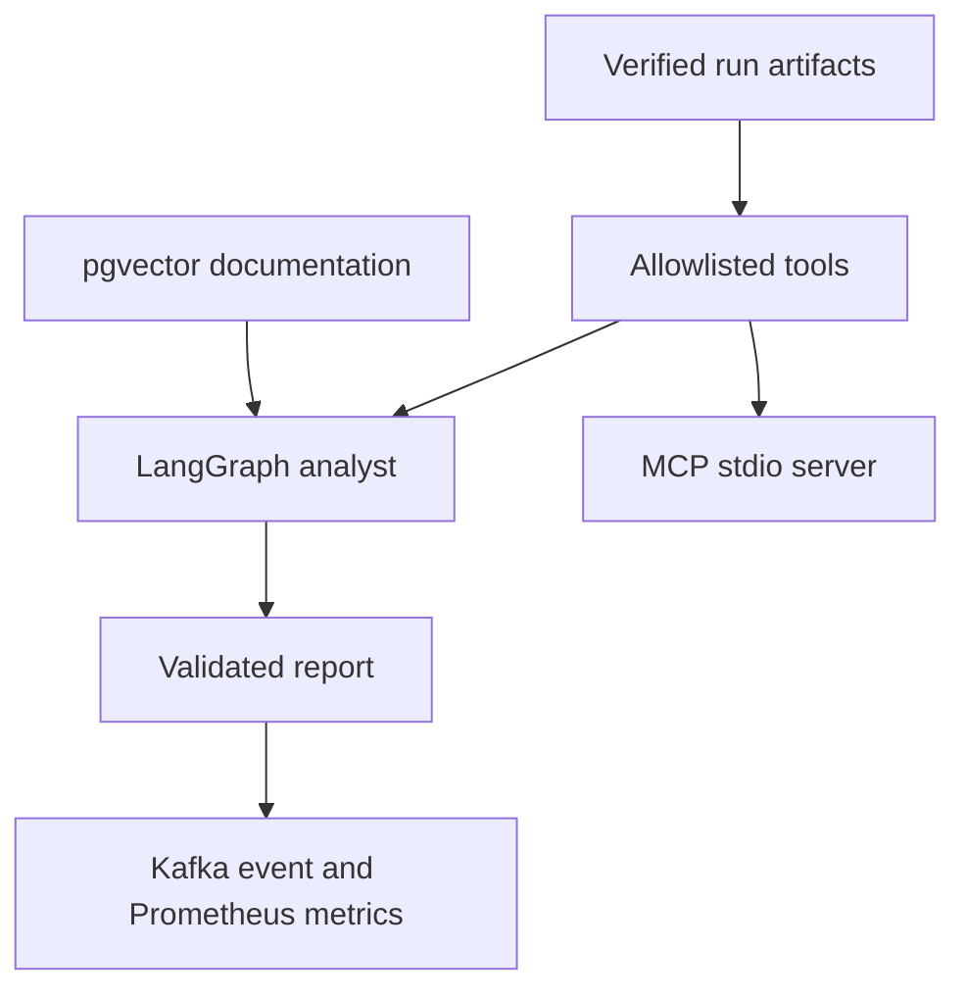

# TaskGraph

Backend research project focused on reproducing and analyzing production-like backend scenarios.

## Stack

Python 3.12 • FastAPI • PostgreSQL/pgvector • SQLAlchemy 2.0 (async) • LangGraph • LangChain tools • Ollama • MCP • Apache Kafka • Prometheus • Docker Compose • Pytest • GitHub Actions

## Goal

TaskGraph reproduces production-like backend scenarios to investigate:
- system behavior
- performance bottlenecks
- latency degradation
- concurrency issues
- failure patterns

Project philosophy:
Reproduce → Measure → Understand → Fix → Verify

## AI Incident Analyst

The AI subsystem analyzes only versioned, checksum-verified demo evidence. A
local Ollama model selects an allowlisted tool; the final technical report is
assembled and validated deterministically, so a small model cannot invent
measurements or return an invalid report.

Implemented:

- LangGraph workflow with bounded planning and repair routes;
- four read-only evidence tools for index, race-condition, and pool incidents;
- pgvector RAG over project documentation with incremental reindexing;
- real MCP stdio server for external tool clients;
- versioned Kafka completion events enabled only by an explicit flag;
- Prometheus metrics for latency, tool calls, validation and delivery;
- 20 deterministic offline eval cases executed in CI without Ollama or network.



Acceptance run after the three backend scenarios and one AI analysis exist:

```bash
docker compose exec app python -m demos final-smoke
```

Add `--publish-kafka` to verify real delivery to the Compose Kafka broker. The
ordinary test suite and offline evals always use `StubLLMProvider` and never
contact Ollama.

## Architecture

```text
FastAPI
├─ PostgreSQL
├─ Redis
├─ RabbitMQ
│   └─ Celery Worker
├─ Kafka
│   └─ Kafka UI
├─ Prometheus / Grafana
└─ Kubernetes Deployment
```

---

## Cases

1. PostgreSQL Performance

Seq Scan vs Index Scan.

Verified local run:
- PostgreSQL 15.18
- 200,000 rows
- median of 5 measured executions
- 13.505 ms → 0.016 ms
- Seq Scan → Index Scan
- shared buffer hits: 1667 → 4

Investigation:
- selectivity
- EXPLAIN (ANALYZE, BUFFERS, FORMAT JSON)

Reproduce:
`docker compose exec app python -m demos index-scan --confirm-reset`

---

2. Connection Pool Exhaustion

The reproducible demo applies five concurrent requests to an undersized pool,
then repeats the identical load after matching pool capacity to concurrency.
The verified result records three pool timeouts before and zero after.

Reproduce:
`docker compose exec app python -m demos pool-exhaustion --confirm-load`

Key finding:
async != infinite parallelism

---

3. Race Condition

Concurrent update investigation.

Implemented:
- Last Write Wins
- Pessimistic Locking
- Optimistic Locking

Verified local run:
- PostgreSQL 15.18 with `read committed` isolation
- two distinct PostgreSQL connections per strategy
- Last Write Wins reproduced a lost update
- `SELECT FOR UPDATE` lock wait: 1.009599 s
- stale version update affected 0 rows
- accepted update incremented version from 1 to 2
- API version conflict maps to HTTP 409

Reproduce:
`docker compose exec app python -m demos race-condition --confirm-write`

---

4. Recursive Graph Traversal

Recursive CTE traversal.

Protection:
- depth limit

Result:
11 ms → 0.2 ms

---

5. Redis Cache

Cache Aside Pattern.

Implemented:
- Redis cache
- TTL expiration
- cache hit / cache miss flow

Result:
- reduced PostgreSQL load
- faster repeated requests

---

6. Async Processing

RabbitMQ + Celery integration.

Implemented:
- message broker
- background workers
- asynchronous task execution

Result:
- immediate HTTP response
- background task processing
- decoupled architecture

---

7. Event Streaming

Apache Kafka integration.

Implemented:
- Kafka broker
- Kafka UI
- Producer
- Topic-based event publishing

Result:
- events stored in Kafka topics
- event-driven communication model
- topic inspection through Kafka UI

---

8. Kubernetes Deployment

Local Kubernetes deployment.

Implemented:
- Namespace
- Deployment
- Service (NodePort)
- Pod management
- kubectl troubleshooting

Investigated:
- ErrImageNeverPull
- Service routing
- Endpoint registration

Used:
- kubectl describe
- kubectl logs
- kubectl get endpoints

Result:
- TaskGraph deployed inside Kubernetes
- Pod started successfully
- Service endpoint registered
- HTTP requests reached application through ClusterIP

Key finding:
Deployment and Service should be validated independently.

---

## Monitoring

TaskGraph includes:
- Prometheus
- Grafana
- custom FastAPI metrics
- k6 load testing

Used for:
- request count
- latency visualization
- load investigation

---

## CI/CD

GitHub Actions pipeline automatically:
- installs project dependencies
- creates environment variables for tests
- runs pytest test suite
- runs the 20-case offline AI evaluation and MCP transport gate
- builds Docker image
- publishes Docker image to GitHub Container Registry (GHCR)

Pipeline status is displayed via CI badge at the top of this README.

Implemented using GitHub Actions and GitLab CI.

---

## Testing

- Pytest
- GitHub Actions
- GitLab CI

Performance:
- k6 load testing
- connection pool investigation

Run:
`docker compose exec app python -m pytest -q`

---

## Reproducible Demos

Engineering cases are executed from code and store raw measurements together
with generated reports.

Run the PostgreSQL index case:

```bash
docker compose exec app python -m demos index-scan --confirm-reset
```

Run the concurrency case:

```bash
docker compose exec app python -m demos race-condition --confirm-write
```

Detailed commands and result-file descriptions:
`demos/README.md`

---

## Run

docker compose up -d --build

Swagger:
http://localhost:8000/docs

Kafka UI:
http://localhost:8080

RabbitMQ UI:
http://localhost:15672

Prometheus:
http://localhost:9090

Grafana:
http://localhost:3000

---

## Documentation

Detailed case documentation:
docs/cases/

Architecture decisions:
docs/adr/

Research materials:
research/
